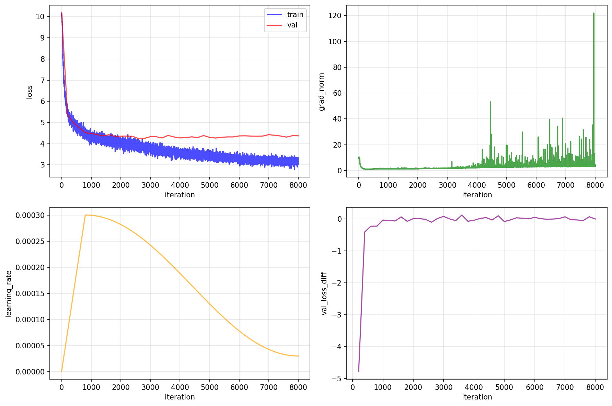

# NumpyGPT

GPT from scratch. Just NumPy and Python.


## why?

Understanding comes from building. This repo implements the core pieces of neural networks - modules, tokenizers, optimizers, backpropagation - using only NumPy. No autograd, no tensor abstractions. Every gradient computation is explicit.

## quick start

**Installation:**

```bash
# Using uv (recommended)
uv sync --extra dev

# Or using pip
pip install -e ".[dev]"
```

**Usage:**

```python
# Tokenize data (available char-level, word-level, or subword with BPE)
./datagen.py

# Train a GPT model
./train.py

# Generate text from trained model
./sample.py

# Plot training curves
./plot.py

# Test the implementation
./test.py
```

**core modules:**
- `Linear`, `Embedding`, `LayerNorm`, `Softmax`, `ReLU`, `MultiHeadAttention`, `FeedForward`
- `Adam` first-order optimizer
- `Tokenizers` char-level, word-level, bpe
- `GPT` model (transformer decoder)

**educational resources:**
- [BACKPROP.md](docs/BACKPROP.md) - what it is and how to implement it from scratch
- [OPTIMIZERS.md](docs/OPTIMIZERS.md) - understand the difference between Adam and SGD
- [TOKENIZERS.md](docs/TOKENIZERS.md) - understand the difference between character-level, word-level, and BPE tokenization

## implementation

```python
# Every layer follows this pattern
class Linear:
    def __init__(self, in_features, out_features):
        self.W = np.random.randn(in_features, out_features) * 0.02
        self.b = np.zeros(out_features)

    def forward(self, X):
        self.X = X  # cache for backward
        return X @ self.W + self.b

    def backward(self, dY):
        # dY: gradient flowing back from next layer
        self.dW = self.X.T @ dY        # gradient w.r.t weights
        self.db = np.sum(dY, axis=0)   # gradient w.r.t bias
        dX = dY @ self.W.T             # gradient w.r.t input
        return dX
```

## project structure

```
numpyGPT/
├── nn/
│   ├── modules/         # Linear, Embedding, LayerNorm, etc.
│   └── functional.py    # cross_entropy, softmax, etc.
├── optim/               # Adam optimizer + LR scheduling
├── utils/data/          # DataLoader, Dataset
├── tokenizer/           # Character, word-level & BPE tokenizers
└── models/GPT.py        # Transformer implementation

datagen.py              # Data preprocessing
train.py                # Training script
sample.py               # Text generation
plot.py                 # Training curves (requires matplotlib)
test.py                 # Test suite
```

## features

- **Explicit gradients** - see exactly how backprop works
- **PyTorch-like API** - familiar interface
- **Complete transformer** - multi-head attention, feedforward, layer norm
- **Flexible tokenization** - character, word-level, or BPE preprocessing
- **Extensive testing** - test correctness of forward and backward for every layer
- **Minimal dependencies** - just numpy and standard library

Perfect for understanding how modern language models actually work.

## resources that I found helpful
- [pytorch's repo](https://github.com/pytorch/pytorch) – architecture and API inspiration
- [building micrograd [YT]](https://www.youtube.com/watch?v=VMj-3S1tku0&ab_channel=AndrejKarpathy) - backprop from scratch, explained simply
- [micrograd](https://github.com/karpathy/micrograd) - A tiny scalar-valued autograd engine
- [CNN in Numpy for MNIST](https://github.com/ScottBiggs2/Generative-AI-Projects/blob/main/AI%20in%20Numpy/NNs%20from%20Scratch%20-%20Clean.ipynb) - CNN in NumPy for MNIST
- [layerNorm implementation in llm.c (Karpathy's again <3)](https://github.com/karpathy/llm.c/blob/master/doc/layernorm/layernorm.md) - layernorm fwd-bwd implementation with torch
- [kaggle's L-layer neural network using numpy](https://www.kaggle.com/code/mtax687/l-layer-neural-network-using-numpy) - cats/dogs classifier using numpy
- [forward and Backpropagation in Neural Networks using Python](https://github.com/xbeat/Machine-Learning/blob/main/Forward%20and%20Backpropagation%20in%20Neural%20Networks%20using%20Python.md) - forward + backward pass walkthrough

---

# EXPERIMENTS: BPE vs Word vs Character

Three ways to represent text, three different models, **same Shakespeare**. Let's see what happens.

## the setup

Trained three identical transformer models on Shakespeare, only difference: how we tokenize the text.

## hyperparameters

| Parameter | Value |
|-----------|-------|
| **batch_size** | 16 |
| **block_size** | 128 |
| **max_iters** | 8,000 |
| **lr** | 3e-4 |
| **min_lr** | 3e-5 |
| **n_layer** | 4 |
| **n_head** | 4 |
| **n_embd** | 256 |
| **warmup_iters** | 800 |
| **grad_clip** | 1.0 |


## the tokenizers

### character-level
```
"Hello" → ['H', 'e', 'l', 'l', 'o']
```
One character = one token.

### word-level
```
"Hello world!" → ['hello', 'world', '!']
```
One word = one token.

Split on spaces and punctuation, lowercase everything to limit OOV (i.e., UNK).

### bpe (Byte Pair Encoding)
```
"Hello" → ['H', 'ell', 'o']  # learned subwords
```
Learns frequent character pairs using [BPE](https://en.wikipedia.org/wiki/Byte_pair_encoding), builds subwords bottom-up.

## training results

| Metric | Character | Word | BPE |
|--------|-----------|------|-----|
| **Final Loss** | 1.5 ⭐ | 3.0 | 3.0 |
| **Output Readability** | ❌ (broken words) | ✅ | ✅ ⭐ |
| **OOV Handling** | ✅ | ❌ | ✅ |
| **Semantic Coherence** | ❌ | ✅ | ✅ |
| **Character Names** | ❌ | ✅ | ✅ |
| **Natural Phrases** | ❌ | ✅ | ✅ |
| **Training Speed** | Fast → Unstable | Steady | Slow but Stable |
| **Number of chars (500 tokens)** | 490 | 1602 ⭐ | 1505 |
| **Number of parameters** | 3.23M ⭐ | 6.55M | 6.55M |
| **Embedding-related parameters** | 68k (2.11%)⭐ | 3.4M (52%) | 3.4M (52%) |


## training curves

Each model comes with a 2×2 panel of plots to track training:

* **Top Left**: Training and validation loss over time
* **Top Right**: Gradient norm (watch for spikes = instability)
* **Bottom Left**: Learning rate schedule (warmup + cosine decay)
* **Bottom Right**: Validation loss improvement per eval window

## training curves

### character-level


### word-level


### bpe




## output quality

Asked each model to generate 500 tokens of Shakespeare:

### bpe output
Complete output: [bpe.out](assets/outputs/bpe.out)
```
KING HENRY PERCY:
And kill me Queen Margaret, and tell us not, as I have obstition?

NORTHUMBERLAND:
Why, then the king's son,
And send him that he were,
```

### word output
Complete output: [word.out](assets/outputs/word.out)

(Yes, I know I still have some tokenization issues...)
```
king to uncrown him as to the afternoon of aboard.
lady anne:
on a day - gone; and, for
should romeo be executed in the victory!
```

### character output
Complete output: [char.out](assets/outputs/char.out)
```
KINGAll, and seven dost I,
And will beset no specommed a geles, and cond upon
you with speaks, but ther so ent the vength
```

## key insights

1. **Lower loss ≠ better output**: Character model had lowest loss but worst readability --> loss is lower because the model is predicting 1 of 69 characters, which is much easier than predicting 1 of 6,551 words/subwords.
2. **Number of parameters**: Despite having the same architecture configuration, the BPE and word level have a much larger embedding matrix that brings its parameters from 3.2M to 6.55M (52% just embedding-related tokens).
3. **Token efficiency matters**: Same 500 output tokens generated vastly different text lengths: from ~500 with character, ~1500 with BPE and ~1600 with word.
4. **Stability matters**: BPE's consistent training beats unstable fast learning
5. **The curse of granularity**: Finer tokens (char) = easier prediction but harder composition. Coarser tokens (word) = harder prediction but natural composition.
6. **There's no free lunch**: Each approach trades off different aspects


TODOs:

- bpe with byte-fallback
