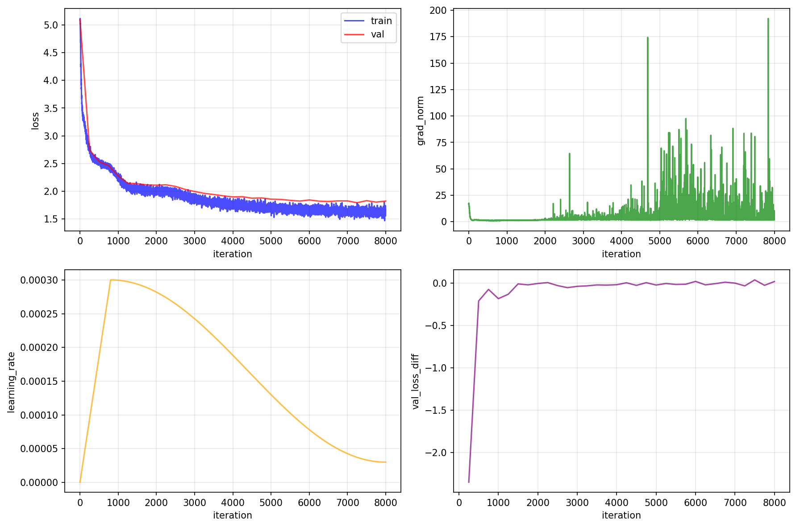
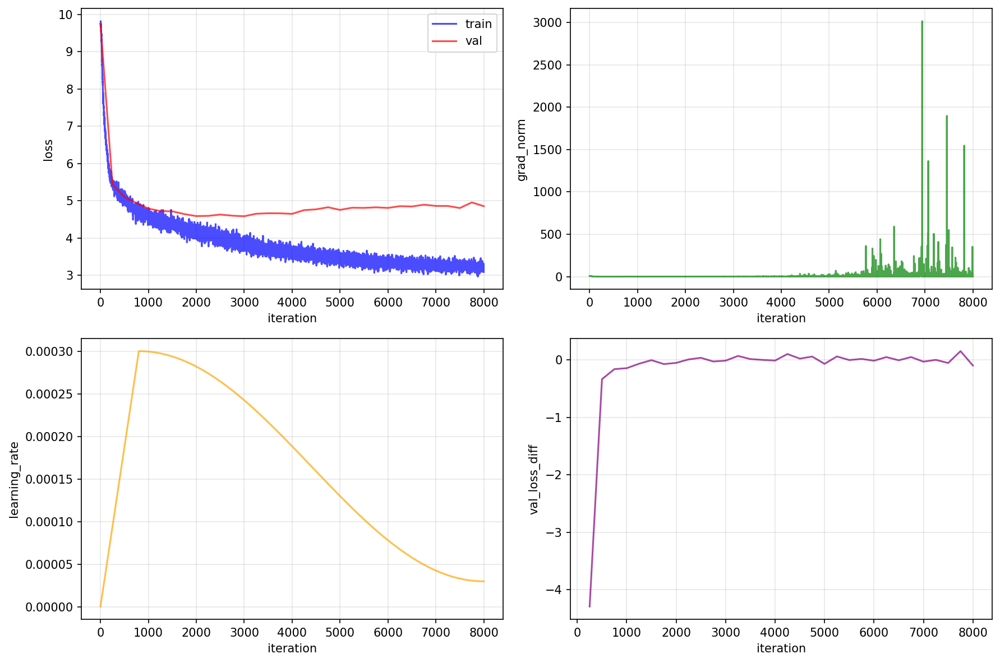

# BPE vs Word vs Character

Three ways to chop up text, three different models, same Shakespeare. Let's see what happens.

## The Setup

Trained three identical transformer models on Shakespeare, only difference: how we tokenize the text.

- **Model**: Same architecture, same hyperparameters
- **Vocab size**: 6,551 tokens each  
- **Parameters**: 6.55M each
- **Training**: 8,000 iterations, identical settings

The only variable: how we split "To be or not to be" into tokens.

## Hyperparameters

Everything that matters for reproduction:

| Parameter | Value |
|-----------|-------|
| **batch_size** | 16 |
| **block_size** | 128 |
| **max_iters** | 8,000 |
| **lr** | 3e-4 |
| **min_lr** | 3e-5 |
| **n_layer** | 4 |
| **n_head** | 4 |
| **n_embd** | 256 |
| **warmup_iters** | 800 |
| **grad_clip** | 1.0 |


## The Tokenizers

### Character-level
```
"Hello" → ['H', 'e', 'l', 'l', 'o']
```
One character = one token.

### Word-level  
```
"Hello world!" → ['hello', 'world', '!']
```
Split on spaces and punctuation, lowercase everything.

### BPE (Byte Pair Encoding)
```
"Hello" → ['H', 'ell', 'o']  # learned subwords
```
Learns frequent character pairs with [BPE](https://en.wikipedia.org/wiki/Byte_pair_encoding), builds subwords bottom-up.

## Training Results

Looking at the loss curves, here's what went down:

| Metric | Character | Word | BPE |
|--------|-----------|------|-----|
| **Final Loss** | 1.5 ⭐ | 1.8 | 3.2 |
| **Training Stability** | ❌ (gradient explosions) | ✅ | ✅ |
| **Max Gradient Norm** | ~200 | ~25 | ~25 |
| **Output Readability** | ❌ (broken words) | ✅ ⭐ | ⚠️ (subword artifacts) |
| **OOV Handling** | ✅ | ❌ | ✅ |
| **Semantic Coherence** | ❌ | ✅ | ⚠️ |
| **Character Names** | ❌ | ✅ | ✅ |
| **Natural Phrases** | ❌ | ✅ | ⚠️ |
| **Training Speed** | Fast → Unstable | Steady | Slow but Stable |
| **Number of chars (500 tokens)** | 490 | 1602 ⭐ | 1505 |
| **Number of parameters** | 3.23M ⭐ | 6.55M | 6.55M |
| **Embedding-related parameters** | 68k (2.11%)⭐ | 3.4M (52%) | 3.4M (52%) |


Ah, got it — you're looking for a structural description of the plots, not analysis of their content. Here's the revised section to add after the table, matching your style:

---

## Training Curves

Each model comes with a 2×2 panel of plots to track training:

* **Top Left**: Training and validation loss over time
* **Top Right**: Gradient norm (watch for spikes = instability)
* **Bottom Left**: Learning rate schedule (warmup + decay)
* **Bottom Right**: Validation loss improvement per eval window

## Training Curves

### Character-level



### Word-level



### BPE


## Output Quality

Asked each model to generate 500 tokens of Shakespeare:

### BPE Output
Complete output: [bpe.out](../assets/outputs/bpe.out)
```
KING HENRY Willimyself
I play the north,
But thou wilt fall of thy foul iry;
Nor tice Phaunt thy days possession to thy head
```

### Word Output  
Complete output: [word.out](../assets/outputs/word.out)

(Yes, I know I still have some tokenization issues...)
```
king to uncrown him as to the afternoon of aboard.
lady anne:
on a day - gone; and, for
should romeo be executed in the victory!
```

### Character Output
Complete output: [char.out](../assets/outputs/char.out)
```
KINGAll, and seven dost I,
And will beset no specommed a geles, and cond upon
you with speaks, but ther so ent the vength
```

## Key Insights

1. **Lower loss ≠ better output**: Character model had lowest loss but worst readability --> It's because the character model is predicting 1 of 69 characters, which is much easier than predicting 1 of 6,551 words.
2. **Number of parameters**: Despite having the same architecture configuration, the BPE and word level have a much larger embedding matrix that brings its parameters from 3.2M to 6.55M (52% just embedding-related tokens).
3. **Token efficiency matters**: Same 500 output tokens generated vastly different text lengths: from ~500 with character, ~1500 with BPE and ~1600 with word.
4. **Stability matters**: BPE's consistent training beats unstable fast learning  
6. **The curse of granularity**: Finer tokens (char) = easier prediction but harder composition. Coarser tokens (word) = harder prediction but natural composition.
7. **There's no free lunch**: Each approach trades off different aspects
